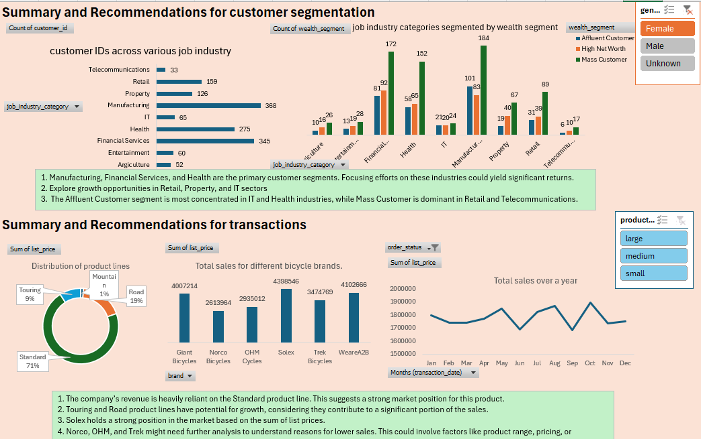

# KPMG Data Analysis

This project analyzes customer data, transaction trends, and new customer insights to inform marketing strategies, business expansion, and product offerings. The analysis provides actionable insights based on data from various customer demographics, transaction behaviors, and market segments.

## 🔍 Dataset Overview

The dataset consists of the following key components:

1. **Customer Data**: Includes detailed customer addresses and property information.
2. **Customer Demographic Data**: Provides insights into customer job details, demographics, and purchasing behavior.
3. **Transaction Data**: Contains product details, transaction dates, and sales performance.
4. **New Customer Data**: Focuses on potential new customers and their estimated value based on different criteria.

## 📈 Key Findings

### ✅ Customer Segmentation:
- **Primary Segments**: 
  - Manufacturing
  - Financial Services
  - Health
- **Growth Opportunities**:
  - Retail
  - Property
  - IT
- **Wealth Segments**:
  - **Affluent Customers**: Most concentrated in **IT** and **Health**.
  - **Mass Customers**: Dominating **Retail** and **Telecommunications** industries.

### ✅ Transaction Analysis:
- **Strong Market Position**:
  - **Standard Product Line**: Dominates sales.
- **Growth Potential**:
  - **Touring** and **Road** product lines show promising growth opportunities.
- **Market Position of Brands**:
  - **Solex** holds a strong position, while **Norco**, **OHM**, and **Trek** need further analysis.
- **Sales Decline in September**: Investigated the reason behind the decline and identified corrective actions to avoid future occurrences.

### ✅ New Customer Insights:
- **Highest Customer Counts**: 
  - Found in **Manufacturing** and **Financial Services** sectors.
- **Opportunities for Tailored Products/Services**: 
  - Potential for offering custom products and services based on industry and wealth segment.

### ✅ Customer Lifetime Value (CLV):
- **CLV Trends**: 
  - Consistent across different wealth segments, but there is potential for increased CLV by focusing on **Affluent Customers**.

## 📝 Recommendations

### Marketing Strategies:
- **Target High-Value Segments**:
  - Tailor marketing strategies to focus on affluent customers with exclusive offers, VIP treatments, and loyalty programs.
  - Custom campaigns for **Manufacturing**, **Financial Services**, and **Health** industries to further engage these segments.

### Business Expansion:
- **Focus on QLD and VIC**:
  - These regions show strong growth potential due to solid distribution networks. Tailored marketing campaigns should be implemented to capitalize on this.
  
### Product Offerings:
- **Introduce Product Variations**: 
  - Diversify offerings to better meet customer needs based on purchasing behavior.
  - Regularly update the product portfolio and refine based on sales trends and customer feedback.
  
## 🚀 Data-Driven Strategies for Business Success

This analysis highlights how data-driven strategies can significantly improve customer engagement, increase CLV, and drive business success. By focusing on the right market segments, offering tailored products, and expanding in the right regions, businesses can achieve sustainable growth.

## Conclusion

Leveraging data analytics can provide businesses with the insights they need to make informed decisions and optimize their marketing, sales, and expansion strategies. The key findings and recommendations presented here can help guide businesses toward better targeting, more effective strategies, and overall success.

## Acknowledgements
- Thanks to all the contributors and data sources that made this analysis possible.
